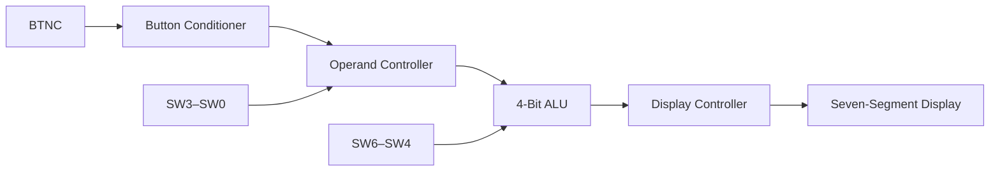

# Basys 3 Modular 4-Bit ALU

A modular 4-bit arithmetic logic unit implemented in Verilog for the Digilent Basys 3 FPGA board.

The design accepts two unsigned 4-bit operands through the board switches, captures them sequentially using a debounced pushbutton, performs the selected operation, and presents the result as a decimal number on the four-digit seven-segment display.

## Features

* Two sequentially entered 4-bit operands
* Debounced and synchronized pushbutton input
* FSM-based operand-entry controller
* Modular synthesizable Verilog design
* Decimal output from 0 to 225
* Signed subtraction display using a separate negative flag
* Integer division with fractional parts discarded
* Division-by-zero detection displaying `Err`
* Multiplexed four-digit seven-segment display
* Self-checking ALU and controller testbenches

## Supported Operations

The operation is selected using switches `SW6–SW4`.

| Opcode    | Operation        | Description                                           |
| --------- | ---------------- | ----------------------------------------------------- |
| `000`     | Addition         | `A + B`                                               |
| `001`     | Subtraction      | `A - B`, displayed with a negative sign when required |
| `010`     | Multiplication   | `A × B`                                               |
| `011`     | Integer division | `A / B`, with the fractional part discarded           |
| `100–111` | Reserved         | Currently returns zero                                |

Division by zero is detected separately and displayed as:

```text
Err
```

## Board Controls

| Basys 3 control       | Function                   |
| --------------------- | -------------------------- |
| `SW3–SW0`             | Current 4-bit operand      |
| `SW6–SW4`             | Operation selection        |
| `BTNC`                | Submit operand             |
| `BTNU`                | Reset                      |
| Seven-segment display | Live operand or ALU result |

## Operation

1. Set `SW3–SW0` to operand A.
2. Press and release `BTNC`.
3. Set `SW3–SW0` to operand B.
4. Press and release `BTNC`.
5. Select the operation using `SW6–SW4`.
6. Read the result from the seven-segment display.
7. To start another calculation, set the new operand A and press `BTNC`.

The operation switches remain live while the result is displayed, allowing different operations to be tested using the same stored operands.

## Architecture



## Module Structure

```text
rtl/
├── top.v
├── alu_4bit.v
├── button_conditioner.v
├── operand_controller.v
└── seven_segment_display.v

tb/
├── alu_4bit_tb.v
└── operand_controller_tb.v

constraints/
└── Basys3.xdc
```

### `alu_4bit.v`

A combinational ALU implementing addition, subtraction, multiplication and integer division. It produces:

* An 8-bit result
* A negative-result flag
* A division-by-zero flag

Subtraction is represented as a positive magnitude accompanied by a separate negative flag, simplifying decimal display generation.

### `button_conditioner.v`

Processes the asynchronous mechanical pushbutton using:

* A two-flip-flop synchronizer
* A 10 ms debounce interval
* Rising-edge detection

Each physical press produces exactly one clock-cycle pulse.

### `operand_controller.v`

An FSM with three states:

```text
ENTER_A → ENTER_B → SHOW_RESULT
```

It stores each operand and controls whether the display shows the live switch value or the ALU result.

### `seven_segment_display.v`

Converts the 8-bit binary result into hundreds, tens and ones, removes unnecessary leading zeroes, and multiplexes the four physical display digits.

The far-left digit is used for a negative sign. A division-by-zero condition overrides the numeric output and displays `Err`.

### `top.v`

Instantiates and connects all modules and maps the board-level inputs to the internal design.

## Verification

### ALU Testbench

`alu_4bit_tb.v` exhaustively tests:

```text
8 opcodes × 16 values of A × 16 values of B = 2048 test cases
```

The testbench automatically calculates the expected result and checks:

* ALU result
* Negative flag
* Division-by-zero flag
* Default behaviour for reserved opcodes

Successful output:

```text
ALL 2048 ALU TESTS PASSED
```

### Controller Testbench

`operand_controller_tb.v` verifies:

* Reset behaviour
* Operand A capture
* Operand B capture
* Transition to the result state
* Starting a subsequent calculation
* Returning to the initial state after reset

Successful output:

```text
ALL CONTROLLER TESTS PASSED
```

## Target Hardware

* Digilent Basys 3
* AMD/Xilinx Artix-7 `XC7A35T-1CPG236C`
* 100 MHz onboard clock

## Building in Vivado

1. Create a new RTL project targeting the Basys 3.
2. Add all files from `rtl/` as design sources.
3. Set `top.v` as the synthesis top.
4. Add `constraints/Basys3.xdc`.
5. Run synthesis.
6. Run implementation.
7. Generate the bitstream.
8. Connect the Basys 3 and program the device using Hardware Manager.

To run a testbench:

1. Add the relevant file from `tb/` as a simulation source.
2. Set the testbench as the simulation top.
3. Run behavioral simulation.
4. Check the Tcl Console for the pass/fail result.

## Example Calculations

|  A |  B | Operation        | Display |
| -: | -: | ---------------- | ------: |
|  8 |  2 | Addition         |    `10` |
|  8 |  2 | Subtraction      |     `6` |
|  2 |  8 | Subtraction      |    `-6` |
| 15 | 15 | Multiplication   |   `225` |
|  7 |  2 | Integer division |     `3` |
|  8 |  0 | Division         |   `Err` |

## Future Improvements

* Add AND, OR and XOR operations
* Add shift operations
* Add carry, zero and overflow flags
* Add button-conditioner verification
* Add a complete top-level integration testbench
* Add synthesis utilization and timing results
* Add a hardware demonstration video
